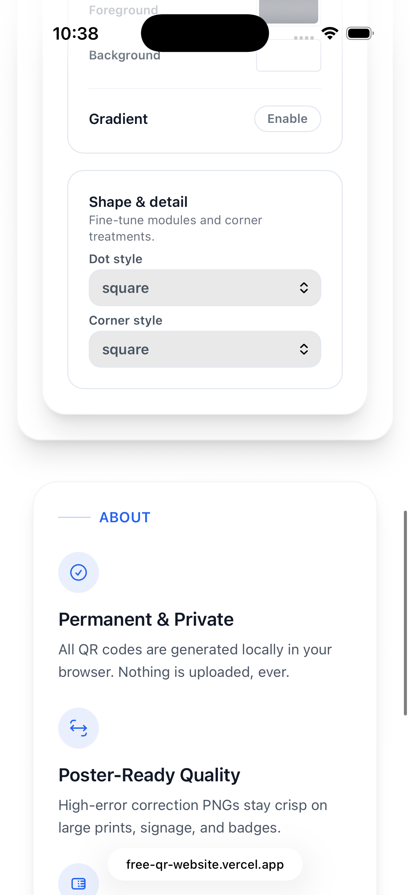
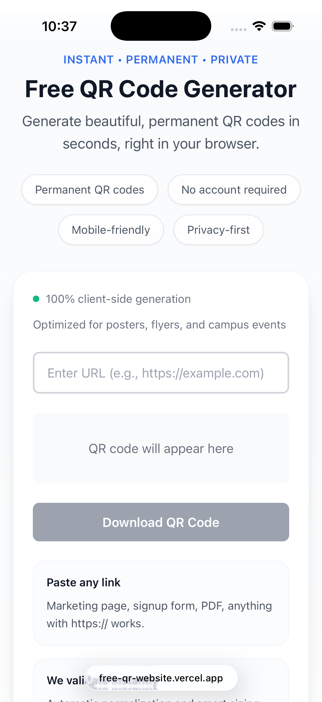

# FreeQRCodeWebsite

A free, permanent QR code generator designed for personal use and marketing teams. Generate QR codes from URLs instantly - no accounts, no expiration, completely free.

## Screenshots

### Desktop


### iOS / Mobile

<table>
<tr>
<td width="50%">

</td>
<td width="50%">

</td>
</tr>
<tr>
<td colspan="2" align="center">

</td>
</tr>
</table>

## Features

- **Completely Free Forever**: No hidden costs, no premium tiers, no account required
- **Permanent QR Codes**: QR codes never expire - perfect for printed marketing materials
- **Mobile-First**: Works perfectly on iPhone and mobile devices
- **Grandma-Friendly**: So simple that even non-technical users can use it effortlessly
- **Beautiful Design**: Modern, beautiful interface that inspires confidence and trust

## Tech Stack

- **React 18+** with TypeScript
- **Vite** for fast development and building
- **Tailwind CSS** for mobile-first styling
- **qrcode.js** for client-side QR code generation
- **Vercel** for deployment

## Getting Started

### Prerequisites

- Node.js 18+ (LTS version)
- npm 9+ (comes with Node.js)

### Installation

```bash
# Install dependencies
npm install

# Start development server
npm run dev

# Build for production
npm run build

# Preview production build
npm run preview
```

## Development

This project follows the BMad Method workflow. See `docs/` folder for:

- **PRD.md** - Product Requirements Document
- **ux-design-specification.md** - UX Design Specification
- **architecture.md** - Technical Architecture
- **epics.md** - Epic and Story Breakdown

## Deployment

This project is deployed on Vercel. See `docs/architecture.md` for deployment details.

## Contributing

We love contributions! 🎉 This project is open source and we welcome anyone who wants to help make it better. Whether you're fixing bugs, adding features, improving documentation, or suggesting ideas - every contribution matters!

### How to Contribute

1. **Fork the repository** and clone it to your local machine
2. **Create a branch** for your changes (`git checkout -b feature/amazing-feature`)
3. **Make your changes** and test them thoroughly
4. **Commit your changes** with clear, descriptive messages
5. **Push to your fork** and open a Pull Request

### What You Can Contribute

- 🐛 **Bug Fixes**: Found a bug? Fix it and submit a PR!
- ✨ **New Features**: Have an idea for a cool feature? We'd love to see it!
- 📝 **Documentation**: Help improve our docs, add examples, or fix typos
- 🎨 **UI/UX Improvements**: Make the interface even more beautiful and user-friendly
- 🧪 **Tests**: Add tests to improve code coverage and reliability
- 🌍 **Translations**: Help us reach more users by translating the interface
- 💡 **Ideas**: Open an issue to discuss new features or improvements

### Getting Help

- Check existing [Issues](https://github.com/yourusername/FreeQRCodeWebsite/issues) to see if your question has been asked
- Open a new issue if you find a bug or have a feature request
- Feel free to ask questions in discussions!

### Code Style

- Follow the existing code style and patterns
- Write clear, self-documenting code
- Add comments for complex logic
- Ensure your code passes linting (`npm run lint`)
- Run tests before submitting (`npm test`)

See [CONTRIBUTING.md](CONTRIBUTING.md) for more detailed guidelines.

## License

This project is free and open source. See [LICENSE](LICENSE) for details.

